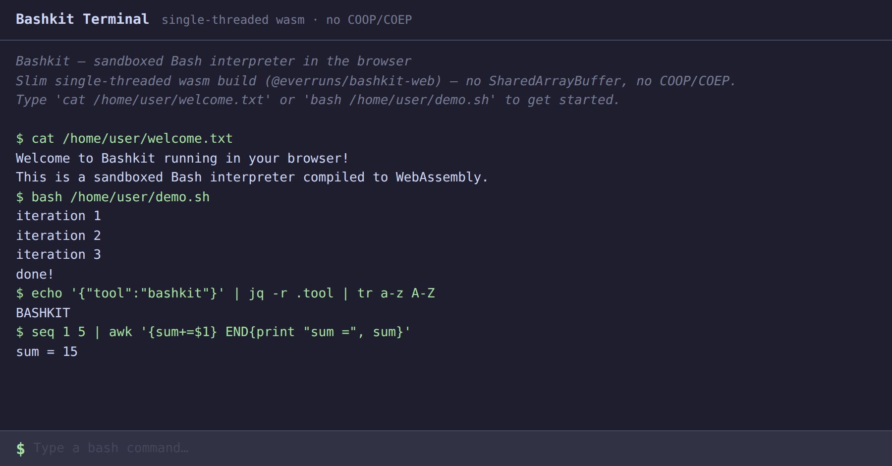

# Bashkit Browser Example

A sandboxed Bash interpreter running entirely in the browser via WebAssembly.



## Quick Start

```bash
# Requires: rustup target add wasm32-wasip1-threads
npm install
npm start
```

`npm start` builds the WASM binary and starts the Vite dev server. Open http://localhost:5173.

## How It Works

Bashkit compiles to `wasm32-wasip1-threads` via [napi-rs](https://napi.rs). The browser loads the WASM binary through `@napi-rs/wasm-runtime`, which provides WASI preview1 support and a thread pool using Web Workers + SharedArrayBuffer.

The terminal UI is a single `index.html` — no framework, no build step beyond WASM compilation.

## Scripts

| Command | Description |
|---------|-------------|
| `npm start` | Build WASM + start dev server |
| `npm run dev` | Start dev server (WASM must already be built) |
| `npm run build` | Build WASM + production bundle |
| `npm run build:wasm` | Build WASM only |

## Requirements

- Node.js >= 18
- Rust with `wasm32-wasip1-threads` target
- Browser with SharedArrayBuffer support (requires COOP/COEP headers, configured in `vite.config.js`)
